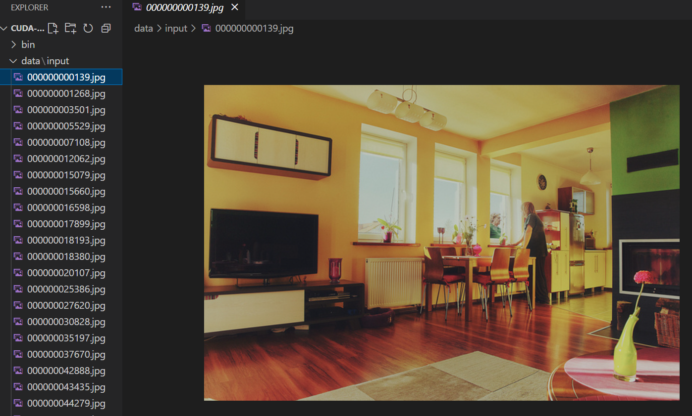
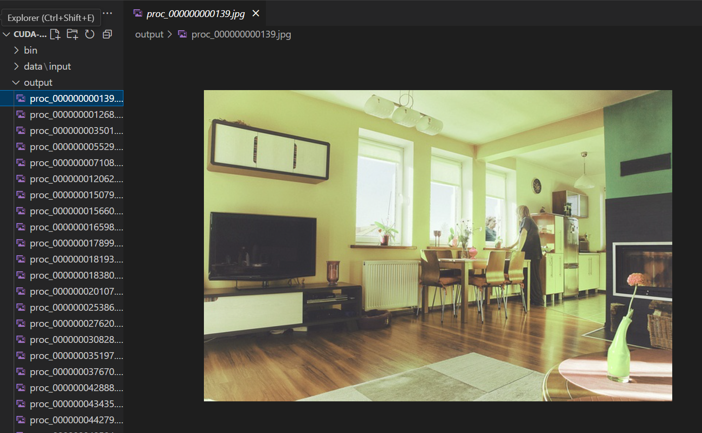

# CUDA-Batch-Image-Processor
A  GPU-accelerated image processing tool built with CUDA 11.8 and OpenCV, capable of processing hundreds of images in batch mode. The project demonstrates CUDA kernels for scaling and filtering images, with efficient memory handling and multi-threaded execution. Includes a Makefile and CLI for flexible execution.

## Goal
Process **hundreds of images** on GPU with CUDA, measure transfer/compute time, and prove scaling using **multiple CUDA streams**.

## What it does
- Loads all images from `data/input/`.
- Copies them to the GPU in **batches across N streams** (default 4).
- Applies a **per-pixel CUDA kernel** (brightness/contrast + channel remap) to every image.
- Copies results back and writes to `output/`.
- Logs timings (H2D, kernel, D2H, total) to `output/timings.csv`.

## **Project Structure**
CUDA-Batch-Image-Processor/
│
├── src/                # CUDA kernels and main.cu
├── data/
│   ├── input/          # Input images
│   └── output/         # Processed images
├── bin/                # Compiled executable
├── proof/              # Screenshots for proof of execution
├── Makefile            # Build instructions
└── README.md           # Project documentation


## **Dependencies**
- [CUDA Toolkit 11.8](https://developer.nvidia.com/cuda-11-8-0-download-archive)
- [OpenCV 4.1.1](https://opencv.org/releases/)
- Microsoft Visual Studio 2022 (x64 Native Tools Command Prompt)

---

## **Build Instructions**
1. Open **"x64 Native Tools Command Prompt for VS 2022"**.
2. Navigate to the project directory:
   ``` cd C:\....Your Path Name to....\CUDA-Batch-Image-Processor ```
3. Clean old Build (optional)
    ```make clean ```
4. Compile the Project
    ```make ```
5. Run the executable
    ```.\bin\batch_proc.exe data\input output 1.2 20 4 ```
    here, 
        1.2 = brightness factor
        20 = blur kernel size
        4 = number of GPU streams

## **Proof of Execution**
### Terminal Output

### Input Sample

### Output Sample


**Inference:**  
The program successfully processed the entire batch of 100 images.  
- Brightness was increased by a factor of `1.2`.  
- A Gaussian blur with a kernel size of `20` was applied.  
- The results were saved in the `output/` folder.  

If additional images are added to the `data/input/` folder, the program will process all of them in one batch automatically.


## **Lessons Learned**
1. Linking CUDA with OpenCV requires careful management of NVCC flags and the Visual Studio toolchain.

2. GPU parallelism significantly reduces processing time compared to CPU-only implementations.

3. Batch processing with streams can overlap data transfer and computation for better performance.


